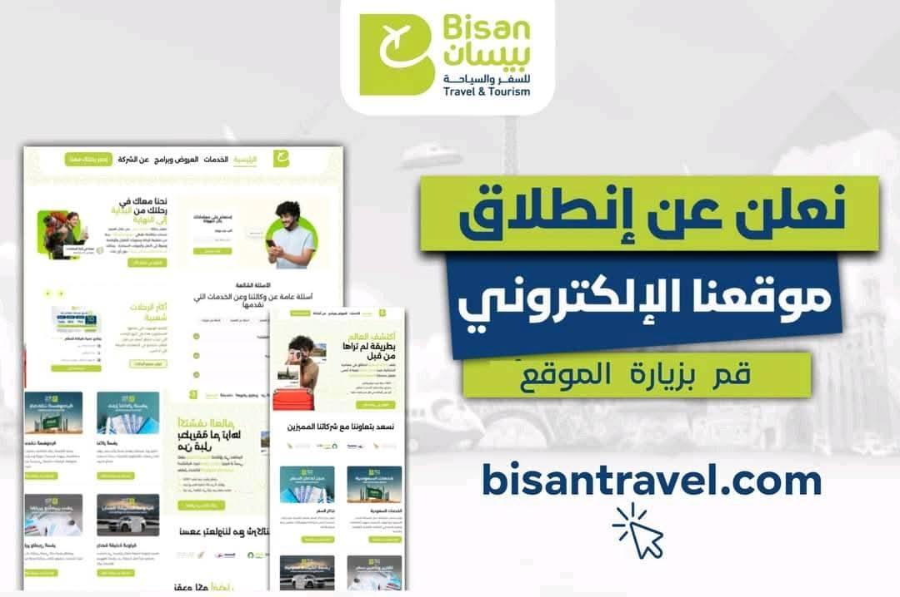

<h1 align="center">Bisan Travel</h1>

Full-stack travel platform built to manage booking workflows, administration, and dynamic content.

  
  
  

  

## Overview

Bisan Travel is a production-oriented travel platform created to support booking operations and admin-side management from a single system. The project combines a responsive frontend with backend tools for permissions, content handling, and business workflows.

## Project Snapshot

- Role: Full-Stack Developer
- Focus: Frontend, backend, dashboard and admin panel, authentication, deployment, and system integration
- Live website: https://www.bisantravel.com/

## Tech Stack

  

## Key Features

- Booking system
- Dashboard and admin panel
- Role-based access control
- File upload support
- Search, filtering, and pagination
- API integrations
- JWT authentication
- Session-based authentication
- Deployment with cPanel and SSH workflows

## Project Status

- Full source code will be added later
- This repository is currently published as a documented project reference

## Note

This repository has been prepared as a public portfolio entry and can be expanded later with the full source code.
